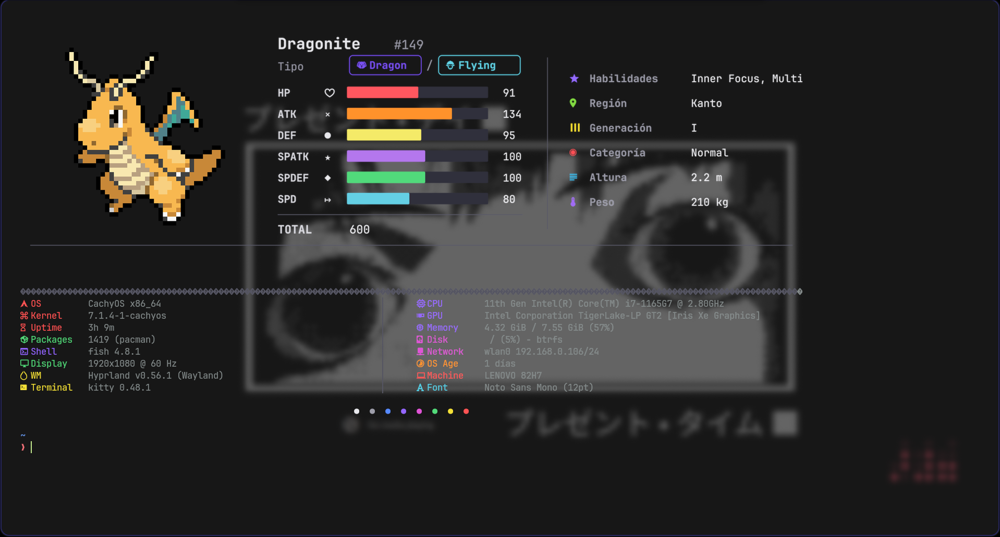

# Pokémon Fastfetch

<p align="center">
  
</p>

<p align="center">
  <strong>A fast, offline Pokémon dashboard for Kitty terminals, built with Bash.</strong>
</p>

<p align="center">
  <a href="https://github.com/But0o/pokemon-fastfetch/actions/workflows/ci.yml">
    
  </a>
  <a href="LICENSE">
    
  </a>
  
  
  
</p>

---

## About

Pokémon Fastfetch replaces a traditional terminal startup screen with a Pokémon panel and a two-column system-information dashboard.

It combines:

- a locally cached Pokédex;
- local Pokémon artwork;
- ImageMagick rendering;
- Kitty's graphics protocol;
- Bash-based system detection;
- Fish shell integration.

After installation, normal usage does not require an internet connection. Rendered Pokémon panels are cached and reused until their source data, image, dimensions, or renderer version changes.

---

## Highlights

- Random Pokémon whenever a Kitty terminal opens
- Select Pokémon by name or National Pokédex number
- Fixed-Pokémon and random modes
- Offline Pokédex data
- Cached PNG rendering
- Base stats, abilities, types, region, generation, height, weight, and category
- System information panel
- Configurable panel dimensions and visibility
- XDG-compatible installation paths
- Fish shell integration
- Safe reinstall and migration workflow
- Backups of previous installations
- Shared Bash utility library
- Automated tests
- ShellCheck validation
- GitHub Actions continuous integration

---

## Preview

The upper panel contains Pokémon information:

- sprite;
- name and Pokédex number;
- primary and secondary types;
- HP, Attack, Defense, Special Attack, Special Defense, and Speed;
- total base stats;
- abilities;
- region and generation;
- category;
- height and weight.

The lower section contains system information such as:

- operating system and kernel;
- uptime and package count;
- shell, terminal, window manager, and display;
- CPU, GPU, memory, disk, and network;
- machine model, installation age, and font.

---

## Requirements

### Runtime

- Linux
- Bash
- Kitty and `kitten`
- `jq`
- ImageMagick (`magick`)
- `fontconfig` and `fc-match`
- JetBrains Mono Nerd Font
- a local Pokémon image collection, such as `pokimg`

The main scripts also use standard Linux utilities including `awk`, `sed`, `find`, `shuf`, `tput`, `df`, `uname`, `hostname`, `stat`, `date`, and `tr`.

### Optional integrations

- Fish shell, for the generated `fastfetch` function and terminal autostart
- Hyprland tools, for richer display and window-manager detection
- `xrandr`, as a display-detection fallback
- `lspci` and `lscpu`, for hardware details
- `ip`, for network information
- `pacman` or Flatpak, for package counts

### Arch Linux / CachyOS

Install the main packages with:

```bash
sudo pacman -S --needed \
  bash \
  fish \
  kitty \
  jq \
  imagemagick \
  fontconfig \
  pciutils \
  iproute2
```

Install ShellCheck for development:

```bash
sudo pacman -S --needed shellcheck
```

A Nerd Font package may also be required depending on your system configuration.

---

## Installation

Clone the repository:

```bash
git clone https://github.com/But0o/pokemon-fastfetch.git
cd pokemon-fastfetch
```

Run the installer:

```bash
chmod +x install.sh
./install.sh
```

The installer:

1. validates the required project files;
2. validates Bash syntax and the bundled Pokédex;
3. checks runtime dependencies;
4. detects the Pokémon image directory;
5. backs up an existing installation when needed;
6. installs the scripts and shared library;
7. writes or updates the user configuration;
8. copies the bundled Pokédex into the cache;
9. generates Fish integration;
10. validates the installed files.

### Non-interactive installation

```bash
./install.sh --yes
```

### Disable terminal autostart

```bash
./install.sh --no-autostart
```

### Specify the image directory

```bash
./install.sh --pokemon-dir "$HOME/.local/share/pokimg/images"
```

Alternative example:

```bash
./install.sh --pokemon-dir "$HOME/pokimg/images"
```

### Installer options

| Option | Description |
|---|---|
| `--yes`, `-y` | Accept installer confirmations automatically |
| `--no-autostart` | Do not launch Pokémon Fastfetch automatically in new Kitty sessions |
| `--pokemon-dir PATH` | Use a specific Pokémon image directory |
| `--help`, `-h` | Show installer help |

---

## Usage

The installer creates a Fish function named `fastfetch` that forwards arguments to Pokémon Fastfetch.

### Random Pokémon

```bash
fastfetch
```

### Pokémon by name

```bash
fastfetch pikachu
fastfetch charizard
fastfetch rayquaza
```

### Pokémon by Pokédex number

```bash
fastfetch 25
fastfetch 6
fastfetch 384
```

### Random Pokémon for one execution

```bash
fastfetch --random
```

The alias below is also accepted:

```bash
fastfetch random
```

### Force a new render

```bash
fastfetch --rerender pikachu
```

This removes cached panels matching the request before rendering again.

### Help

```bash
fastfetch --help
```

You may also call the installed script directly:

```bash
~/.local/share/pokemon-fastfetch/random-fastfetch.sh pikachu
```

---

## Fixed Pokémon mode

Choose a Pokémon that should appear whenever a new terminal opens:

```bash
fastfetch --set gengar
```

A number also works:

```bash
fastfetch --set 94
```

Return to automatic random selection:

```bash
fastfetch --random-mode
```

The fixed selection is stored at:

```text
~/.config/pokemon-fastfetch/fixed-pokemon
```

---

## Configuration

The installer creates:

```text
~/.config/pokemon-fastfetch/config
```

The file is sourced by the Bash scripts, so values use shell-assignment syntax.

Example:

```bash
# Pokémon Fastfetch
# File managed by install.sh

# Paths
POKEMON_DIR=/home/user/.local/share/pokimg/images
CACHE_DIR=/home/user/.cache/pokemon-fastfetch
INSTALL_DIR=/home/user/.local/share/pokemon-fastfetch

# Pokémon panel
POKEMON_PANEL_WIDTH=1580
POKEMON_PANEL_HEIGHT=470
POKEMON_PANEL_ROWS=22

# System panel
SYSTEM_PANEL_MAX_WIDTH=150
COLUMN_GAP=6

# Visual options
SHOW_SYSTEM_INFO=true
SHOW_COLOR_PALETTE=true
```

### Visual settings

| Variable | Default | Purpose |
|---|---:|---|
| `POKEMON_PANEL_WIDTH` | `1580` | Width of the rendered Pokémon PNG |
| `POKEMON_PANEL_HEIGHT` | `470` | Height of the rendered Pokémon PNG |
| `POKEMON_PANEL_ROWS` | `22` | Number of terminal rows reserved for the Kitty image |
| `SYSTEM_PANEL_MAX_WIDTH` | `150` | Maximum width of the lower system panel |
| `COLUMN_GAP` | `6` | Spacing between system-information columns |
| `SHOW_SYSTEM_INFO` | `true` | Show or hide the system-information section |
| `SHOW_COLOR_PALETTE` | `true` | Show or hide the terminal color dots |

Example: show only the Pokémon panel:

```bash
SHOW_SYSTEM_INFO=false
```

Example: hide only the color palette:

```bash
SHOW_COLOR_PALETTE=false
```

During a reinstall or upgrade, the installer updates managed paths while preserving known visual preferences.

---

## XDG paths

Pokémon Fastfetch follows XDG base-directory variables when they are defined.

| Purpose | Default path |
|---|---|
| Installation | `~/.local/share/pokemon-fastfetch` |
| Configuration | `~/.config/pokemon-fastfetch` |
| Cache | `~/.cache/pokemon-fastfetch` |
| Backups | `~/.local/share/pokemon-fastfetch-backups` |
| Fish integration | `~/.config/fish/conf.d/pokemon-fastfetch.fish` |

These defaults change automatically when `XDG_DATA_HOME`, `XDG_CONFIG_HOME`, or `XDG_CACHE_HOME` are set.

---

## Cache and offline behavior

### Pokédex

```text
~/.cache/pokemon-fastfetch/pokedex.json
```

The installer copies the repository's bundled file:

```text
config/pokedex.json
```

Normal Pokémon selection and rendering use this local cache.

### Rendered panels

```text
~/.cache/pokemon-fastfetch/panels-v2/
```

Each panel filename includes a hash derived from:

- renderer version;
- panel width and height;
- Pokémon data;
- source-image modification time.

This allows previously rendered panels to be reused safely.

### Temporary rendering files

```text
~/.cache/pokemon-fastfetch/render-temp/
```

Temporary SVG and PNG files for a successful render are removed after the final panel is generated.

### Rebuilding enriched data

`build-pokedex-cache.sh` can enrich an existing cache using PokeAPI. Network access is used only during this maintenance operation, not during normal terminal startup.

```bash
~/.local/share/pokemon-fastfetch/build-pokedex-cache.sh
```

The cache builder:

- validates the current JSON;
- creates a timestamped backup;
- reuses entries that already contain complete statistics and abilities;
- retries failed API requests;
- preserves existing entries when an API request fails;
- writes the finished cache atomically;
- verifies the final entry count.

---

## Updating

Pull the latest repository changes:

```bash
cd ~/pokemon-fastfetch
git pull origin main
```

For a regular reinstall using the current architecture:

```bash
./install.sh
```

For migration from an older installation:

```bash
./upgrade-v1-to-v2.sh
```

### Upgrade options

| Option | Description |
|---|---|
| `--yes`, `-y` | Accept confirmations automatically |
| `--no-autostart` | Disable automatic startup |
| `--pokemon-dir PATH` | Specify the image directory |
| `--help`, `-h` | Show migration help |

The migration process is designed to:

- detect previous installations;
- create backups;
- preserve a valid legacy Pokédex;
- remove obsolete Fish references;
- delegate the final installation to the current installer.

---

## Uninstallation

Remove the installed scripts, configuration, and Fish integration:

```bash
./uninstall.sh
```

Skip confirmation:

```bash
./uninstall.sh --yes
```

Also remove the cache:

```bash
./uninstall.sh --remove-cache
```

Also remove installation backups:

```bash
./uninstall.sh --remove-backups
```

Remove everything managed by the project:

```bash
./uninstall.sh \
  --yes \
  --remove-cache \
  --remove-backups
```

### Uninstaller options

| Option | Description |
|---|---|
| `--yes`, `-y` | Do not request confirmation |
| `--remove-cache` | Remove the Pokémon Fastfetch cache |
| `--remove-backups` | Remove installer and migration backups |
| `--help`, `-h` | Show uninstaller help |

The cloned Git repository itself is not removed by the uninstaller.

---

## Project structure

```text
pokemon-fastfetch/
├── .github/
│   └── workflows/
│       └── ci.yml
├── config/
│   └── pokedex.json
├── docs/
│   └── preview.png
├── lib/
│   └── common.sh
├── tests/
│   └── run-tests.sh
├── .editorconfig
├── .gitignore
├── .shellcheckrc
├── build-pokedex-cache.sh
├── install.sh
├── random-fastfetch.sh
├── render-pokemon.sh
├── uninstall.sh
├── upgrade-v1-to-v2.sh
├── CHANGELOG.md
├── LICENSE
├── README.md
└── VERSION
```

### Main components

| File | Responsibility |
|---|---|
| `random-fastfetch.sh` | Selects a Pokémon, gathers system information, and draws the terminal dashboard |
| `render-pokemon.sh` | Resolves Pokémon data and creates or reuses the cached PNG panel |
| `build-pokedex-cache.sh` | Enriches the local Pokédex through PokeAPI |
| `install.sh` | Validates and installs the application |
| `upgrade-v1-to-v2.sh` | Migrates older installations into the current layout |
| `uninstall.sh` | Removes installed resources |
| `lib/common.sh` | Shared messages, dependency checks, and path/JSON validation |
| `tests/run-tests.sh` | Runs syntax, data, library, and isolated-installation tests |
| `config/pokedex.json` | Bundled offline Pokémon database |

---

## Architecture

```text
User command / terminal startup
              │
              ▼
     random-fastfetch.sh
              │
      ┌───────┴────────┐
      │                │
      ▼                ▼
Local Pokédex     System detection
      │
      ▼
render-pokemon.sh
      │
      ├── Existing hash-matched panel ──► reuse
      │
      └── No cached panel
              │
              ▼
       SVG + sprite render
              │
              ▼
      Cached final PNG
              │
              ▼
       Kitty graphics output
```

Normal execution is local. The network is only relevant when explicitly rebuilding or enriching the Pokédex cache.

---

## Development

### Run the full test suite

```bash
POKEMON_DIR="$HOME/.local/share/pokimg/images" \
  ./tests/run-tests.sh
```

The suite uses a temporary home directory and does not modify the user's real installation.

It currently validates:

- Bash syntax for project scripts;
- required repository files;
- Pokédex JSON validity;
- non-empty Pokédex contents;
- shared-library validation functions;
- isolated installation;
- installed files and entry count;
- command help screens.

### Run ShellCheck

```bash
shellcheck \
  install.sh \
  uninstall.sh \
  upgrade-v1-to-v2.sh \
  random-fastfetch.sh \
  render-pokemon.sh \
  build-pokedex-cache.sh \
  lib/common.sh \
  tests/run-tests.sh
```

### Run Bash syntax checks

```bash
bash -n install.sh
bash -n uninstall.sh
bash -n upgrade-v1-to-v2.sh
bash -n random-fastfetch.sh
bash -n render-pokemon.sh
bash -n build-pokedex-cache.sh
bash -n lib/common.sh
bash -n tests/run-tests.sh
```

### Validate the Pokédex manually

```bash
jq empty config/pokedex.json
jq 'length' config/pokedex.json
```

---

## Continuous integration

The GitHub Actions workflow runs on pushes and pull requests targeting `main`.

The CI job performs:

1. Bash syntax validation;
2. ShellCheck;
3. Pokédex JSON validation;
4. the automated test suite.

A failed check prevents an unnoticed syntax, lint, data, or installation regression from being treated as a valid change.

---

## Troubleshooting

### The image directory is not detected

Specify it explicitly:

```bash
./install.sh --pokemon-dir "/absolute/path/to/images"
```

The directory must contain at least one supported image file. The installer searches for PNG, WebP, JPEG, and GIF files.

### The Pokédex cache is missing

Run the installer again:

```bash
./install.sh --yes
```

The bundled `config/pokedex.json` should be copied into the configured cache directory.

### The cache is invalid

Check it manually:

```bash
jq empty ~/.cache/pokemon-fastfetch/pokedex.json
```

Restore it by reinstalling, or use an installer-created backup when appropriate.

### A Pokémon cannot be found

Try its canonical English API-style name or its Pokédex number:

```bash
fastfetch mr-mime
fastfetch 122
```

The renderer includes normalization for several punctuation-heavy Pokémon names.

### A sprite cannot be found

Check the configured path:

```bash
grep '^POKEMON_DIR=' ~/.config/pokemon-fastfetch/config
```

Confirm that the referenced directory exists and contains the requested Pokémon image.

### The panel appears outdated

Force a new render:

```bash
fastfetch --rerender pikachu
```

### Kitty does not display the panel

Check the terminal:

```bash
printf '%s\n' "$TERM"
```

Expected value inside Kitty:

```text
xterm-kitty
```

Check the graphics helper:

```bash
command -v kitten
```

### The dashboard appears twice

Ensure Pokémon Fastfetch is not started from multiple Fish locations.

The installer-managed integration is:

```text
~/.config/fish/conf.d/pokemon-fastfetch.fish
```

Remove old manual calls from:

```text
~/.config/fish/config.fish
```

### System information is hidden

Check:

```bash
grep '^SHOW_SYSTEM_INFO=' \
  ~/.config/pokemon-fastfetch/config
```

Set it to:

```bash
SHOW_SYSTEM_INFO=true
```

### Colors or icons look incorrect

Confirm that a compatible Nerd Font is installed and selected in Kitty. The renderer searches for JetBrains Mono Nerd Font variants.

---

## Security notes

The configuration file is sourced as Bash code. Only place trusted shell assignments in:

```text
~/.config/pokemon-fastfetch/config
```

Do not copy untrusted commands into that file.

The project does not require elevated privileges for its own installation. System package installation is separate and may require `sudo`.

---

## Compatibility

The project has been developed and tested primarily with:

- CachyOS
- Arch Linux
- Kitty
- Fish
- Hyprland

Other Linux distributions may work when the required commands are available, but package names and optional system-information integrations may differ.

---

## Roadmap

### v2.1

- hardened installer;
- bundled Pokédex installation;
- centralized user configuration;
- preserved visual preferences;
- shared Bash library;
- consistent validation and error handling;
- safer migration workflow;
- centralized version source;
- automated test suite;
- ShellCheck-clean codebase;
- GitHub Actions CI;
- expanded documentation.

### v2.2

Planned areas of work:

- smarter and approximate Pokémon search;
- richer local Pokémon metadata;
- additional command-line filters;
- visual themes;
- compact layouts for narrow terminals;
- improved cache-management commands.

### Future

- AUR packaging;
- additional sprite providers or styles;
- broader shell integration;
- community-contributed themes and layouts.

---

## Contributing

Issues and pull requests are welcome.

Before submitting a change:

1. keep the scope focused;
2. preserve Bash compatibility and XDG paths;
3. run `bash -n` on modified scripts;
4. run ShellCheck;
5. run `tests/run-tests.sh`;
6. update documentation when behavior changes.

For larger features, open an issue first so the design can be discussed before implementation.

---

## License

Pokémon Fastfetch is released under the [MIT License](LICENSE).

Pokémon names and related trademarks belong to their respective owners. This is an unofficial fan-made terminal project and is not affiliated with or endorsed by Nintendo, Game Freak, The Pokémon Company, or Creatures Inc.

---

## Author

Developed by [But0o](https://github.com/But0o).
