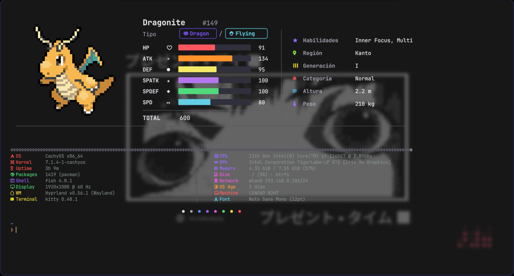

# Pokémon Fastfetch

<p align="center">
  
</p>

<p align="center">
  <strong>Un Pokémon distinto cada vez que abrís la terminal, con sus estadísticas y la información de tu sistema.</strong><br>
  Hecho en Bash para Kitty. Funciona sin internet.
</p>

<p align="center">
  <a href="https://github.com/But0o/pokemon-fastfetch/actions/workflows/ci.yml">
    
  </a>
  <a href="LICENSE">
    
  </a>
  
  
  
</p>

---

## Contenido

- [Qué es](#qué-es)
- [Requisitos](#requisitos)
- [Instalación](#instalación)
- [Comandos](#comandos)
- [Modos](#modos)
- [Pokémon shiny](#pokémon-shiny)
- [Gen 9 y sprites faltantes](#gen-9-y-sprites-faltantes)
- [Configuración](#configuración)
- [Cómo funciona](#cómo-funciona)
- [Actualizar y desinstalar](#actualizar-y-desinstalar)
- [Solución de problemas](#solución-de-problemas)
- [Desarrollo](#desarrollo)
- [Créditos y licencia](#créditos-y-licencia)

---

## Qué es

Pokémon Fastfetch reemplaza la pantalla de inicio de la terminal por un panel con dos partes:

**Arriba, la Pokédex:** el sprite del Pokémon, su nombre y número, tipos, las seis estadísticas base con barras, el total, habilidades, región, generación, categoría, altura y peso.

**Abajo, tu sistema:** sistema operativo, kernel, uptime, paquetes, shell, pantalla, gestor de ventanas, terminal, CPU, GPU, memoria, disco, red, antigüedad de la instalación, modelo del equipo y fuente.

Características principales:

- **Pokémon al azar** en cada terminal nueva, o uno fijo que elijas vos.
- **Shiny:** 1 en 20 chances de que salga shiny, más comandos para verlos cuando quieras.
- **1025 Pokémon**, de la Gen 1 a la Gen 9, buscables por nombre o número.
- **Responsive:** el panel ocupa todo el ancho de la terminal y se reacomoda si es angosta o baja.
- **Rápido:** los paneles se guardan en caché y el próximo Pokémon se prepara en segundo plano.
- **Sin internet:** la Pokédex viene incluida. Solo se usa internet para descargar sprites o agregar Pokémon nuevos.

---

## Requisitos

- Linux
- [Kitty](https://sw.kovidgoyal.net/kitty/), la terminal: el panel usa su protocolo de imágenes.
- Fish como shell, para el comando `pokefetch` y el inicio automático.
- `jq`, ImageMagick (7 u 6) y `fontconfig`.
- Una [Nerd Font](https://www.nerdfonts.com/), idealmente **JetBrains Mono Nerd Font**, para los íconos.
- Los sprites de [pokimg](https://github.com/FuzzyGrim/pokimg).

Opcionales, para más información del sistema: `lspci` y `lscpu` (hardware), `ip` (red), `hyprctl` (Hyprland) o `xrandr` (pantalla).

En **Arch Linux / CachyOS**:

```bash
sudo pacman -S --needed bash fish kitty jq imagemagick fontconfig pciutils iproute2 ttf-jetbrains-mono-nerd
```

---

## Instalación

**1. Descargá los sprites de pokimg** en la carpeta donde el instalador los busca:

```bash
git clone https://github.com/FuzzyGrim/pokimg.git ~/.local/share/pokimg
```

**2. Cloná este repositorio:**

```bash
git clone https://github.com/But0o/pokemon-fastfetch.git ~/Proyectos/pokemon-fastfetch
cd ~/Proyectos/pokemon-fastfetch
```

**3. Instalá:**

```bash
./install.sh
```

El instalador verifica las dependencias, encuentra la carpeta de sprites, instala los scripts, crea la configuración y agrega el comando `pokefetch` a Fish. Si ya tenías una instalación, primero hace una copia de respaldo.

**4. Abrí una terminal Kitty nueva.** Ya debería aparecer un Pokémon.

### Opcional: shiny y Gen 9

pokimg trae los Pokémon hasta la Gen 8. Para sumar los shiny y la Gen 9, seguí la sección [Gen 9 y sprites faltantes](#gen-9-y-sprites-faltantes).

### Opciones del instalador

| Opción | Qué hace |
|---|---|
| `--yes`, `-y` | Acepta las confirmaciones automáticamente |
| `--pokemon-dir RUTA` | Usa otra carpeta de sprites |
| `--no-autostart` | No muestra el panel al abrir Kitty (solo con el comando) |
| `--no-fastfetch-alias` | Crea solo `pokefetch` y no toca el comando `fastfetch` |
| `--help`, `-h` | Muestra la ayuda |

---

## Comandos

Para ver todos los comandos en la terminal, junto con el modo que tenés activo:

```bash
pokefetch comandos
```

`pokefetch --help`, `pokefetch -h` y `pokefetch ayuda` muestran lo mismo.

> Todos los comandos funcionan también con `fastfetch` en lugar de `pokefetch`. Si tenés instalado el [fastfetch](https://github.com/fastfetch-cli/fastfetch) original, sigue disponible con `command fastfetch`.

### Mostrar un Pokémon

| Comando | Qué hace |
|---|---|
| `pokefetch` | Muestra un Pokémon según el modo actual |
| `pokefetch pikachu` | Busca por nombre |
| `pokefetch 25` | Busca por número de Pokédex |
| `pokefetch --random` | Uno al azar, solo esta vez |

Los nombres aceptan mayúsculas, espacios y signos: `pokefetch "Mr. Mime"` funciona igual que `pokefetch mr-mime`.

### Shiny ✦

| Comando | Qué hace |
|---|---|
| `pokefetch --shiny` | Un shiny al azar, solo esta vez |
| `pokefetch --shiny pikachu` | Un shiny puntual, solo esta vez |

### Qué muestran las terminales nuevas

| Comando | Qué hace |
|---|---|
| `pokefetch --random-mode` | Al azar, con probabilidad de shiny (el modo predeterminado) |
| `pokefetch --set pikachu` | Siempre el mismo Pokémon |
| `pokefetch --set-shiny pikachu` | Siempre el mismo, en shiny |
| `pokefetch --shiny-mode` | Siempre un shiny al azar |

### Mantenimiento

| Comando | Qué hace |
|---|---|
| `pokefetch --rerender pikachu` | Vuelve a generar el panel de un Pokémon |
| `pokefetch --version` | Muestra la versión instalada |
| `pokefetch comandos` | Muestra la lista de comandos |

### Scripts del repositorio

Estos se ejecutan desde la carpeta del repositorio (`cd ~/Proyectos/pokemon-fastfetch`):

| Script | Qué hace |
|---|---|
| `./install.sh` | Instala o actualiza |
| `./download-sprites.sh` | Descarga los sprites que faltan y los shiny |
| `./add-missing-pokemon.sh` | Agrega a la Pokédex los Pokémon que tienen sprite pero no datos |
| `./build-pokedex-cache.sh` | Completa datos faltantes de la Pokédex instalada usando PokeAPI |
| `./uninstall.sh` | Desinstala |

---

## Modos

El modo define qué Pokémon aparece al **abrir una terminal nueva**. Se guarda hasta que lo cambies, y podés ver cuál tenés activo con `pokefetch comandos`.

| Modo | Cómo se activa | Qué muestra |
|---|---|---|
| **Aleatorio** | `pokefetch --random-mode` | Un Pokémon distinto cada vez, con 1 en 20 de salir shiny |
| **Fijo** | `pokefetch --set gengar` | Siempre Gengar |
| **Fijo shiny** | `pokefetch --set-shiny gengar` | Siempre Gengar shiny |
| **Solo shiny** | `pokefetch --shiny-mode` | Un shiny distinto cada vez |

Los comandos que dicen "solo esta vez" (`pokefetch pikachu`, `--random`, `--shiny`) no cambian el modo.

---

## Pokémon shiny

Cuando sale un shiny, el panel lo muestra con el sprite shiny y un **✦ Shiny** dorado al lado del número.

- **En modo aleatorio**, cada terminal tiene **1 en 20** chances (5%) de mostrar un shiny. Podés cambiarlo con `POKEMON_SHINY_RATE` en la [configuración](#configuración): `10` los hace más comunes, `100` más raros y `0` los desactiva.
- **Cuando querés uno**, usá `pokefetch --shiny` o `pokefetch --shiny pikachu`.
- **Para que salgan siempre**, usá `pokefetch --set-shiny pikachu` o `pokefetch --shiny-mode`.

Los sprites shiny se descargan con `./download-sprites.sh` y se guardan en la subcarpeta `shiny/` de tus sprites. Si falta el shiny de algún Pokémon, el modo aleatorio usa el sprite normal, y los comandos que piden un shiny explícitamente avisan con un error.

---

## Gen 9 y sprites faltantes

pokimg incluye los Pokémon hasta la Gen 8. Con dos scripts se agregan los que faltan (Leyendas Arceus y la Gen 9) y los 1025 shiny.

**1. Descargá los sprites:**

```bash
cd ~/Proyectos/pokemon-fastfetch
./download-sprites.sh
```

Baja unos 1150 sprites en un par de minutos, con la misma estética que pokimg: íconos de caja de 68×56, recortados y ampliados 9× sin suavizado. Los normales van a tu carpeta de sprites y los shiny a `shiny/`. Los que ya tenés no se vuelven a descargar, así que podés correrlo varias veces sin problema.

| Opción | Qué hace |
|---|---|
| `--only-normal` | Descarga solo los sprites normales |
| `--only-shiny` | Descarga solo los shiny |
| `--dest RUTA` | Usa otra carpeta de sprites |
| `--force` | Vuelve a descargar aunque el archivo exista |
| `--jobs N` | Cantidad de descargas en paralelo (8 por defecto) |

**2. Agregá los Pokémon nuevos a la Pokédex.** Tener el sprite no alcanza: también hacen falta sus datos (tipos, estadísticas, habilidades). Este script los busca en [PokeAPI](https://pokeapi.co/):

```bash
./add-missing-pokemon.sh
```

Solo agrega especies nuevas: ignora las formas alternativas (como `charizard-mega`) y los números repetidos, y hace una copia de respaldo de la Pokédex antes de modificarla.

**3. Reinstalá** para que la versión instalada use la Pokédex nueva:

```bash
./install.sh --yes
```

Listo: `pokefetch sprigatito` o `pokefetch 906` ya funcionan, y la Gen 9 entra en el modo aleatorio.

---

## Configuración

La configuración está en `~/.config/pokemon-fastfetch/config`. Después de editarla, los cambios se aplican en la próxima terminal.

| Variable | Predeterminado | Qué controla |
|---|---|---|
| `POKEMON_SHINY_RATE` | `20` | Probabilidad de shiny en modo aleatorio: 1 en N (`0` los desactiva) |
| `POKEMON_PREFETCH` | `true` | Prepara el próximo Pokémon aleatorio en segundo plano |
| `POKEMON_PANEL_ROWS` | `20` | Altura preferida del panel Pokémon, en filas de la terminal |
| `POKEMON_PANEL_CACHE_MAX` | `60` | Cantidad máxima de paneles guardados en caché |
| `SYSTEM_PANEL_MAX_WIDTH` | `0` | Ancho máximo del panel del sistema en columnas (`0` = todo el ancho) |
| `COLUMN_GAP` | `6` | Espacio entre las columnas del panel del sistema y la barra central |
| `SHOW_SYSTEM_INFO` | `true` | Muestra el panel del sistema |
| `SHOW_COLOR_PALETTE` | `true` | Muestra la paleta de colores al final |
| `POKEMON_DIR` | detectada | Carpeta de sprites |

Las rutas (`POKEMON_DIR`, `CACHE_DIR`, `INSTALL_DIR`) las regenera el instalador. El resto de los valores se conservan al reinstalar, incluidas las variables que agregues a mano.

`POKEMON_PANEL_WIDTH` y `POKEMON_PANEL_HEIGHT` solo se usan si ejecutás `render-pokemon.sh` por separado. En uso normal, el tamaño del panel se calcula a partir de la terminal.

---

## Cómo funciona

### Panel responsive

El panel Pokémon siempre ocupa todo el ancho de la terminal. Se mide la ventana en píxeles y la imagen se genera con ese tamaño exacto, así Kitty no la reescala y la información del sistema queda justo debajo, sin espacios vacíos.

| Terminal | Qué se muestra |
|---|---|
| **Ancha** | Sprite, estadísticas e información. La información queda pegada al borde derecho y las barras se estiran. |
| **Mediana** | Las tres columnas, con el panel un poco más bajo para que entren. |
| **Angosta** | Modo compacto: sprite y estadísticas. |
| **Baja** | El panel se achica para dejar lugar a la información del sistema. |

El panel del sistema también usa todo el ancho, con la barra divisoria en el centro y las dos columnas acomodadas a su alrededor.

### Rendimiento

- **Caché de paneles:** cada panel se genera una sola vez por Pokémon y tamaño de terminal, y después se reutiliza.
- **Pre-render:** en modo aleatorio, mientras usás la terminal se prepara en segundo plano el próximo Pokémon (incluido si va a ser shiny). La terminal siguiente abre casi al instante.
- **Datos del sistema en caché:** CPU, GPU, versiones y fuente se calculan una vez por cada arranque de la computadora.
- **En paralelo:** el panel se genera mientras se junta la información del sistema.

### Rutas

| Qué | Dónde |
|---|---|
| Programa instalado | `~/.local/share/pokemon-fastfetch` |
| Configuración | `~/.config/pokemon-fastfetch/config` |
| Modo actual | `~/.config/pokemon-fastfetch/fixed-pokemon` |
| Pokédex y caché | `~/.cache/pokemon-fastfetch` |
| Paneles generados | `~/.cache/pokemon-fastfetch/panels-v2` |
| Respaldos | `~/.local/share/pokemon-fastfetch-backups` |
| Integración con Fish | `~/.config/fish/conf.d/pokemon-fastfetch.fish` |
| Sprites | `~/.local/share/pokimg/images` (shiny en `shiny/`) |

Si definiste `XDG_DATA_HOME`, `XDG_CONFIG_HOME` o `XDG_CACHE_HOME`, se usan esas carpetas en lugar de las predeterminadas.

---

## Actualizar y desinstalar

### Actualizar

```bash
cd ~/Proyectos/pokemon-fastfetch
git pull origin main
./install.sh --yes
```

Tu configuración, el modo activo y la Pokédex instalada se conservan. Si la Pokédex del repositorio trae más Pokémon, se actualiza y la anterior queda respaldada.

**Desde una versión 1.x**, usá el script de migración: detecta la instalación vieja, hace un respaldo, limpia las referencias antiguas en `config.fish` e instala la versión actual.

```bash
./upgrade-v1-to-v2.sh
```

### Desinstalar

```bash
./uninstall.sh
```

| Opción | Qué hace |
|---|---|
| `--yes` | No pide confirmación |
| `--remove-cache` | También borra la caché (Pokédex instalada y paneles) |
| `--remove-backups` | También borra los respaldos |

No se borran ni el repositorio ni tus sprites.

---

## Solución de problemas

**No aparece ninguna imagen.**
El panel solo funciona en Kitty. Comprobá que `echo $TERM` diga `xterm-kitty` y que `kitten icat` esté disponible.

**No encuentra la carpeta de sprites.**
Indicala a mano al instalar: `./install.sh --pokemon-dir ~/ruta/a/los/sprites`.

**No encuentra un Pokémon.**
Probá con el número (`pokefetch 122`) o con guiones (`pokefetch mr-mime`). Si es de la Gen 9, seguí los pasos de [Gen 9 y sprites faltantes](#gen-9-y-sprites-faltantes).

**Nunca sale un shiny, o `--shiny` da error.**
Faltan los sprites shiny: ejecutá `./download-sprites.sh --only-shiny`. Verificá también que `POKEMON_SHINY_RATE` no sea `0`.

**Un panel se ve desactualizado o mal.**
Regeneralo con `pokefetch --rerender pikachu`.

**La primera terminal tarda más.**
Es normal: con un tamaño de ventana nuevo, el panel se genera por primera vez. Las siguientes usan la caché o el pre-render.

**Se muestra una versión vieja de Kitty o Fish.**
Esos datos se guardan hasta el próximo reinicio. Para actualizarlos antes: `rm ~/.cache/pokemon-fastfetch/system-static.cache`.

**El Disco o la Red dicen "No disponible".**
La red necesita el comando `ip` (paquete `iproute2`). El disco se lee de `df`.

**Quiero el fastfetch original.**
Usá `command fastfetch`, o reinstalá con `./install.sh --no-fastfetch-alias` para que `fastfetch` no se reemplace.

---

## Desarrollo

### Tests

```bash
./tests/run-tests.sh
```

Verifican la sintaxis de todos los scripts, la Pokédex (números consecutivos del 1 en adelante), la biblioteca común, una instalación aislada y el renderizado real de paneles normales, compactos y shiny con ImageMagick 6 o 7.

Para el análisis estático:

```bash
shellcheck *.sh lib/common.sh tests/run-tests.sh
```

GitHub Actions corre ShellCheck, la validación de la Pokédex y los tests en cada push y pull request a `main`.

### Estructura del proyecto

```text
pokemon-fastfetch/
├── .github/workflows/ci.yml   Integración continua
├── config/pokedex.json        Pokédex incluida
├── docs/preview.png           Imagen de este README
├── lib/common.sh              Funciones compartidas
├── tests/run-tests.sh         Tests
├── random-fastfetch.sh        Programa principal: elige el Pokémon y dibuja todo
├── render-pokemon.sh          Genera y cachea el panel Pokémon
├── install.sh                 Instalador
├── uninstall.sh               Desinstalador
├── upgrade-v1-to-v2.sh        Migración desde la versión 1.x
├── download-sprites.sh        Descarga sprites faltantes y shiny
├── add-missing-pokemon.sh     Agrega Pokémon nuevos a la Pokédex
├── build-pokedex-cache.sh     Completa datos de la Pokédex con PokeAPI
├── CHANGELOG.md
├── LICENSE
├── README.md
└── VERSION
```

---

## Créditos y licencia

- Sprites de la Gen 1 a la 8: [pokimg](https://github.com/FuzzyGrim/pokimg), a partir de los íconos de caja de Pokémon Espada/Escudo.
- Shiny y Leyendas Arceus: [PokéSprite](https://github.com/msikma/pokesprite).
- Gen 9: [bamq/pokemon-sprites](https://github.com/bamq/pokemon-sprites), íconos del National Pokédex Version Delta Project adaptados a 68×56. Los créditos de cada artista están en ese repositorio.
- Datos de los Pokémon: [PokeAPI](https://pokeapi.co/).

Pokémon y sus sprites son © Nintendo, Creatures Inc. y GAME FREAK Inc. Este es un proyecto de fans, sin fines comerciales y sin relación con ellos.

El código se distribuye bajo la [licencia MIT](LICENSE).